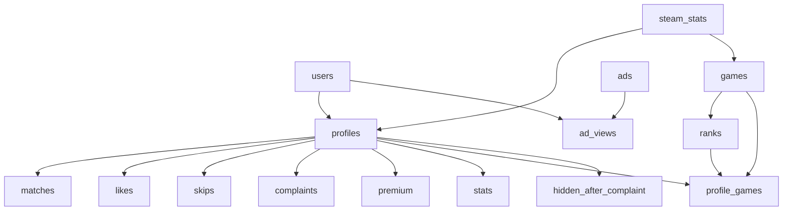

```mermaid
graph TD

  users --> profiles
  users --> ad_views

  profiles --> matches
  profiles --> likes
  profiles --> skips
  profiles --> complaints
  profiles --> premium
  profiles --> stats
  profiles --> profile_games
  profiles --> hidden_after_complaint

  games --> ranks
  games --> profile_games
  ranks --> profile_games

  steam_stats --> profiles
  steam_stats --> games

  ads --> ad_views
```

Диаграмма отображает основные связи между таблицами, представленные в формате graph TD — он гарантированно поддерживается GitHub и Markdown-просмотром.