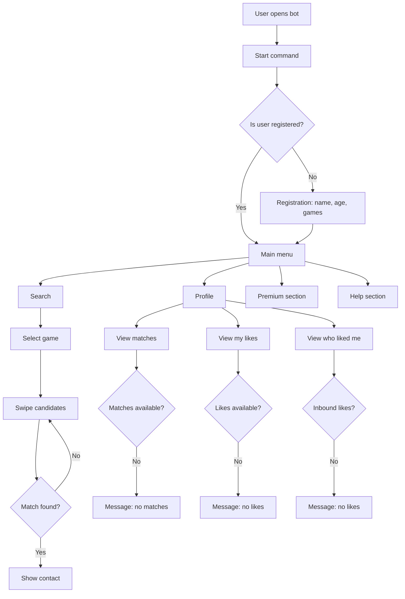

```mermaid
graph TD
    A[User opens bot] --> B[Start command]
    B --> C{Is user registered?}
    C -- No --> D[Registration: name, age, games]
    C -- Yes --> E[Main menu]
    D --> E

    E --> F[Search]
    E --> G[Profile]
    E --> H[Premium section]
    E --> I[Help section]

    F --> F1[Select game]
    F1 --> F2[Swipe candidates]
    F2 --> F3{Match found?}
    F3 -- Yes --> F4[Show contact]
    F3 -- No --> F2

    G --> G1[View matches]
    G1 --> G1a{Matches available?}
    G1a -- No --> G1b[Message: no matches]

    G --> G2[View my likes]
    G2 --> G2a{Likes available?}
    G2a -- No --> G2b[Message: no likes]

    G --> G3[View who liked me]
    G3 --> G3a{Inbound likes?}
    G3a -- No --> G3b[Message: no likes]
```
